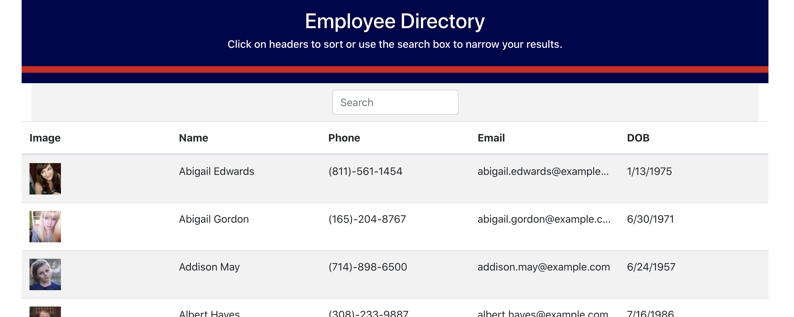

# Unit 19 React Homework: Employee Directory

## Overview

This is an employee directory with React. This assignment required that I break up your application's UI into components, manage component state, and respond to user events.

Try it [HERE](https://ashleylerma.github.io/employee-directory/)

This project was bootstrapped with [Create React App](https://github.com/facebook/create-react-app).

## User Story

- As a user, I want to be able to view my entire employee directory at once so that I have quick access to their information.

## Business Context

An employee or manager would benefit greatly from being able to view non-sensitive data about other employees. It would be particularly helpful to be able to filter employees by name.
